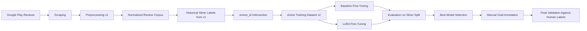
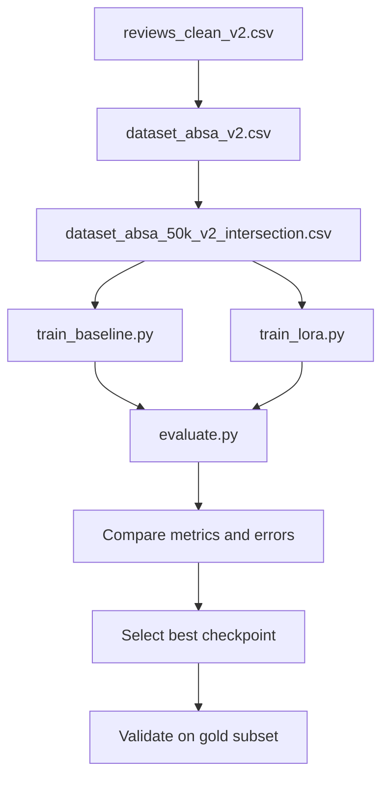

# Fintech Review ABSA


An end-to-end Aspect-Based Sentiment Analysis pipeline for Google Play Store reviews of Indonesian fintech lending apps.

This project focuses on three business-relevant aspects:

- `risk`
- `trust`
- `service`

with three sentiment labels:

- `Negative`
- `Neutral`
- `Positive`

The repository is being developed as both:

- an active thesis/research workspace
- a public portfolio project for NLP, model experimentation, and applied ML engineering

## Why This Project

Most sentiment projects stop at generic positive-vs-negative classification. This one pushes further into aspect-level analysis on Indonesian fintech reviews, where user language is noisy, colloquial, and often mixes product trust, service quality, and perceived risk in the same review.

That makes the project useful for demonstrating:

- practical ABSA pipeline design
- weak-label to cleaner-dataset reconciliation
- IndoBERT fine-tuning and LoRA comparison
- research-oriented experimentation with portfolio-grade packaging

## Current Status

This repository is still **on progress**.

What is already in place:

- v2 preprocessing pipeline
- active v2 training dataset configuration
- baseline and LoRA training scripts
- evaluation pipeline
- Streamlit dashboard
- manual gold subset preparation

What is still ongoing:

- fresh training runs on the active v2 setup
- final comparison on manually annotated gold data
- stronger public demo assets such as screenshots and sample outputs

## Pipeline Overview



## Project Snapshot

| Area | Current Choice |
| --- | --- |
| Domain | Indonesian fintech app reviews |
| Apps | Kredivo, Akulaku |
| Task | 3-aspect ABSA |
| Labels | Negative, Neutral, Positive |
| Backbone | `indobenchmark/indobert-base-p1` |
| Training Tracks | Baseline full fine-tuning, LoRA |
| Active Dataset | `data/processed/dataset_absa_50k_v2_intersection.csv` |
| Final Validation Direction | Manual single-annotator gold subset |

## Experiment Design



## Repository Layout

```text
.
|- app.py                         # Streamlit dashboard
|- config.py                      # central paths and configuration
|- preprocess.py                  # review cleaning and normalization
|- labeling.py                    # LLM-based silver labeling workflow
|- train_baseline.py              # full fine-tuning pipeline
|- train_lora.py                  # LoRA fine-tuning pipeline
|- evaluate.py                    # experiment evaluation and comparison
|- inference.py                   # inference helper for trained models
|- detect_label_noise.py          # weak-label noise filtering utilities
|- predict_mc_dropout.py          # uncertainty estimation utilities
|- retrain_filtered.py            # retraining on filtered subsets
|- scripts/                       # PowerShell and helper scripts
|- docs/                          # project notes and execution docs
|- data/                          # local datasets, manifests, annotation assets
```

## Key Methodology Notes

This part matters if you are reading the repo as a research artifact.

- Historical silver labels were generated on v1 data.
- The active v2 dataset was formed by intersecting v1 silver labels with the v2-cleaned corpus using `review_id`.
- The current gold validation subset is a **single-annotator gold subset**, not a full diamond multi-annotator setup.
- Public GitHub contents intentionally exclude large raw datasets, processed full datasets, and trained model artifacts.

## Quick Start

### Environment Setup

```powershell
python -m venv .venv
.\.venv\Scripts\Activate.ps1
pip install -r requirements.txt
```

### Run Training

Baseline sweep:

```powershell
.\scripts\run_baseline_epochs.ps1
```

LoRA sweep:

```powershell
.\scripts\run_lora_epochs.ps1
```

Run both tracks:

```powershell
.\scripts\run_training_experiments.ps1
```

### Run Evaluation

```powershell
.\.venv\Scripts\python.exe evaluate.py
```

### Run Dashboard

```powershell
.\.venv\Scripts\python.exe -m streamlit run app.py
```

## Main Files to Explore

| File | Purpose |
| --- | --- |
| `train_baseline.py` | baseline full fine-tuning |
| `train_lora.py` | parameter-efficient LoRA fine-tuning |
| `evaluate.py` | experiment comparison and evaluation summary |
| `app.py` | Streamlit interface for live review analysis |
| `scripts/run_baseline_epochs.ps1` | baseline experiment runner |
| `scripts/run_lora_epochs.ps1` | LoRA experiment runner |
| `scripts/build_v2_intersection.py` | build active v2 intersection dataset |
| `scripts/audit_normalization_v2.py` | audit normalization coverage and candidate slang mappings |

## Public Repo Scope

This GitHub version is intentionally lightweight.

Excluded from version control:

- trained model directories
- raw scraped datasets
- full processed research datasets
- local environment files and secrets

Included because they are useful for understanding the work:

- code for the full pipeline
- experiment runners
- methodology notes
- normalization resources
- manifests and annotation support assets

## Portfolio Value

This project demonstrates practical experience in:

- natural language processing
- Indonesian text normalization
- aspect-based sentiment analysis
- weak supervision workflow design
- experiment tracking mindset
- LoRA fine-tuning for transformer models
- Streamlit app prototyping for ML systems

## Next Milestones

- add screenshots and result tables to enrich the public presentation
- add a tiny public sample dataset for demo reproducibility
- complete fresh v2 training comparison
- validate the best model against the manual gold subset
- add a license and lightweight CI checks